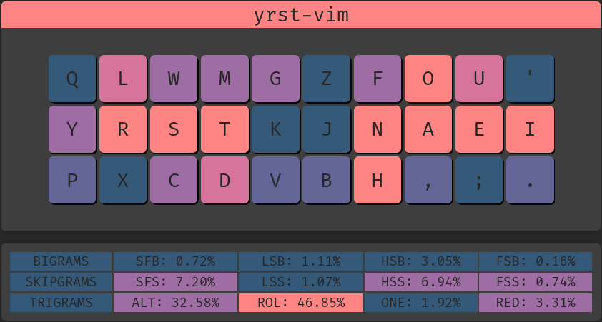

# Keyboard Configuration

## Ergonomic keyboard layout with vim in mind

Alternative layouts [document](https://docs.google.com/document/d/1Ic-h8UxGe5-Q0bPuYNgE3NoWiI8ekeadvSQ5YysrwII/edit?tab=t.0)

Analysis from [keysolve](https://clemenpine.github.io/keysolve-web/)



To analyze it yourself this is the layout:

p l w m g z f o u '<br>
y r s t k j n a e i<br>
q x c d v b h , ; .<br>

***

> [!Important]
>
> Additional remappings of this layout
>
> * Caps -> Escape
> * Ralt -> BackSpace

## Where

This script only changes the layout from a software perspective. It has been tested in a Linux machine and should 'theoretically' work in a Mac

## How to use

### Install layout

```Bash
rm -rf ~/.config/yrst-vim
git clone https://github.com/paualberti/yrst-vim ~/.config/yrst-vim
```

Maintains normal numbers and symbols, Modifies alpha keys (RALT -> BackSpace)<br>
Add this to file /usr/share/X11/xkb/symbols/us:

```C
partial alphanumeric_keys
xkb_symbols "yrst-vim" {

    name[Group1]= "English (yrst-vim)";

    key <TLDE> {	[     grave,	asciitilde	]	};
    key <AE01> {	[	  1,	exclam 		]	};
    key <AE02> {	[	  2,	at		]	};
    key <AE03> {	[	  3,	numbersign	]	};
    key <AE04> {	[	  4,	dollar		]	};
    key <AE05> {	[	  5,	percent		]	};
    key <AE06> {	[	  6,	asciicircum	]	};
    key <AE07> {	[	  7,	ampersand	]	};
    key <AE08> {	[	  8,	asterisk	]	};
    key <AE09> {	[	  9,	parenleft	]	};
    key <AE10> {	[	  0,	parenright	]	};
    key <AE11> {	[     minus,	underscore	]	};
    key <AE12> {	[     equal,	plus		]	};

    key <AD01> {	[	  p,	P 		]	};
    key <AD02> {	[	  l,	L		]	};
    key <AD03> {	[	  w,	W		]	};
    key <AD04> {	[	  m,	M		]	};
    key <AD05> {	[	  g,	G		]	};
    key <AD06> {	[	  z,	Z		]	};
    key <AD07> {	[	  f,	F		]	};
    key <AD08> {	[	  o,	O		]	};
    key <AD09> {	[	  u,	U		]	};
    key <AD10> {	[ apostrophe,	quotedbl	]	};
    key <AD11> {	[ bracketleft,	braceleft	]	};
    key <AD12> {	[ bracketright,	braceright	]	};

    key <AC01> {	[	  y,	Y 		]	};
    key <AC02> {	[	  r,	R		]	};
    key <AC03> {	[	  s,	S		]	};
    key <AC04> {	[	  t,	T		]	};
    key <AC05> {	[	  k,	K		]	};
    key <AC06> {	[	  j,	J		]	};
    key <AC07> {	[	  n,	N		]	};
    key <AC08> {	[	  a,	A		]	};
    key <AC09> {	[	  e,	E		]	};
    key <AC10> {	[ 	  i,	I    		]	};
    key <AC11> {	[     slash,	question	]	};

    key <AB01> {	[	  q,	Q 		]	};
    key <AB02> {	[	  x,	X		]	};
    key <AB03> {	[	  c,	C		]	};
    key <AB04> {	[	  d,	D		]	};
    key <AB05> {	[	  v,	V		]	};
    key <AB06> {	[	  b,	B		]	};
    key <AB07> {	[	  h,	H		]	};
    key <AB08> {	[     comma,	less		]	};
    key <AB09> {	[ semicolon,	colon		]	};
    key <AB10> {	[    period,	greater		]	};

    key <BKSL> {	[ backslash,    bar		]	};
    key <RALT> {	[ BackSpace,	BackSpace	]	};
};
```

(CAPS -> Escape)<br>
Add this to /etc/default/keyboard:

```C
XKBOPTIONS="caps:escape"
```

### Use the new layout

```Bash
setxkbmap -layout us -variant yrst-vim
```
