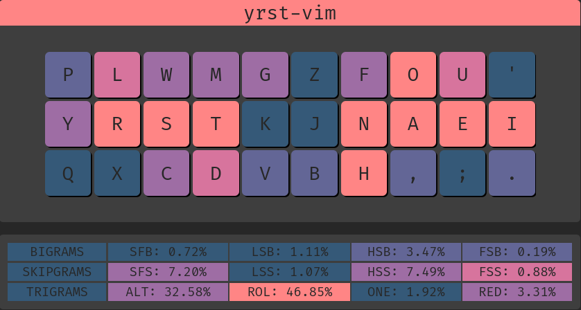

# Keyboard Configuration
## Ergonomic keyboard layout with vim in mind

## Where
This script only changes the layout from a software perspective. It has been tested in a Linux machine and should 'theoretically' work in a Mac
## How to use
### Download the configuration
```
git clone https://github.com/paualberti/yrst-vim ~/.config/yrst-vim
```
### BackUp existing layout
```
mv /usr/share/X11/xkb/symbols/us /usr/share/X11/xkb/symbols/us.bak
mv /etc/default/keyboard /etc/default/keyboard.bak
```
### Apply new layout
```
sudo cp ~/.config/yrst-vim/us /usr/share/X11/xkb/symbols/us
sudo cp ~/.config/yrst-vim/keyboard /etc/default/keyboard
```
### Use the new layout
It is named colemak so that it can be changed from the system settings
```
setxkbmap -layout us -variant colemak
```
